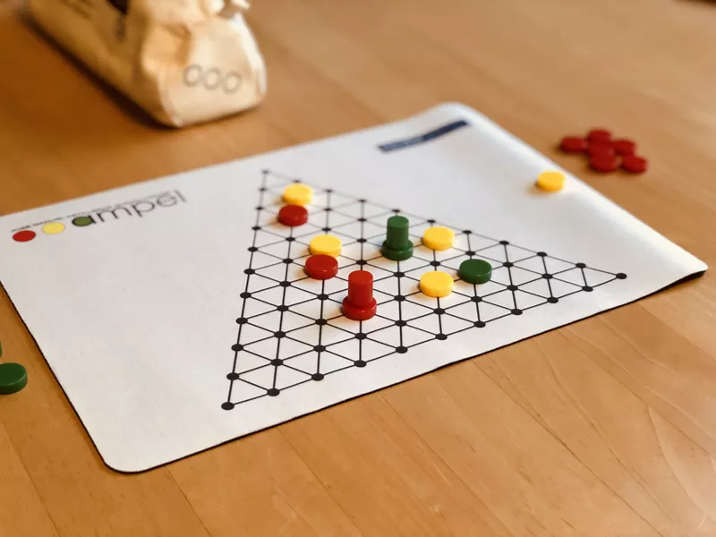

# Ampel / Witch Workbench

A collection of 3D projects developed using **Javascript**, WebGL and **Prolog**, including the [Ampel](https://boardgamegeek.com/boardgame/151978/ampel) board game and a witch's workbench scene as part of the *Laboratório de Aplicações com Interface Gráfica* ([LAIG](https://sigarra.up.pt/feup/pt/ucurr_geral.ficha_uc_view?pv_ocorrencia_id=281214)) course at [FEUP](https://fe.up.pt)

## Ampel Board Game

A 3D implementation of the Ampel board game, showcasing:

- Interactive game board and pieces rendered in 3D.
- **Prolog backend for game logic**, handling game rules, moves, and win conditions.
- Web-based interface for playing against another human or an AI with adjustable difficulty.

### Game Rules

**Ampel** is a two-player abstract strategy game played on a hexagonal grid. The goal is to align your pieces and control space more effectively than your opponent.

Players aim to create valid **traffic lights** (a set of one red, one yellow, and one green piece in a straight line) by strategically placing and moving pieces.

The game is divided into two phases:

#### 🟡 Phase 1: Yellow Placement

- Players alternate turns placing **yellow pieces** on the board.
- Exactly **10 yellow pieces** must be placed in total.
- Yellow pieces **cannot** be placed on the edges of the board.

---

#### 🟢🔴 Phase 2: Movement and Placement

After the 10 yellow pieces are placed, the second phase begins.

On each turn, a player must:

1. Move one piece of their own.
2. Move one of the opponent’s pieces.
3. Place one piece of their color (red or green).

---

#### 🧠 Movement Rules

- Pieces move in straight lines.
- The **distance moved equals the number of pieces** (of any color) in the direction of movement.
- Pieces cannot move through or land on other pieces.

---

#### 🏆 Winning the Game

- The goal is to form **traffic lights**: one red, one yellow, and one green piece aligned in a straight, uninterrupted line.
- Multiple traffic lights can exist.
- The winner is determined by the number of valid traffic lights formed.

> All game rules and logic are enforced by the Prolog engine integrated in the game.

## Witch's Workbench

A 3D animated scene depicting a witch's workbench, built with **custom shaders** and **animation routines**, featuring:

- A bubbling, smoking cauldron with neon green liquid.
- A levitating crystal ball.
- Vials containing various alchemical substances sealed with corks.
- Additional mystical items like a pyramid and a glyph-inscribed cube.

## Contributors

[Nuno Resende](https://github.com/nunores)

[João Gonçalves](https://github.com/SouOCalves)

## License

This project is licensed under the MIT License.

