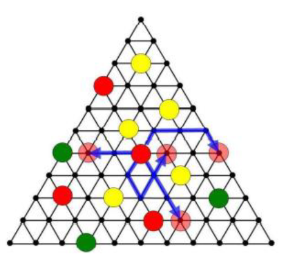

# FEUP-LAIG (Laboratório de Aplicações de Interface Gráfica) 2020/2021

## Group T07G07
| Name             | Number    | Institutional E-Mail              |
| ---------------- | --------- | ------------------  |
| Nuno Resende     | 201806825 | up201806825@fe.up.pt|
| João Gonçalves   | 201806796 | up201806796@fe.up.pt|

----

## Projects

For this course, students were required to implement two projects.

### 1. Witch's Working Bench

The first project consisted of building a 3D animated scene with WebGL and FEUP's [WebCGF library](https://paginas.fe.up.pt/~ruirodrig/pub/sw/webcgf/docs/). Our scene displays a witch's working bench with a cauldron and an evil recipe, a crystal ball, some vials and other trinkets. The smoking, boiling cauldron is seen bubbling with a neon green liquid, the crystal ball is levitating magically, and the vials contain various alchemical contents closed by a cork. The working bench also contains a pyramid and a mysterious cube with glyphs.

### 2. Ampel Board Game

For the second project, we implemented an animated, playable 3D version of the [Ampel](https://boardgamegeek.com/boardgame/151978/ampel) board game. The user interacts with the pieces on the board by clicking with the left mouse button.

#### Instructions

The game's objective is of placing the given red, yellow and green pieces so that **traffic lights** are built. 

In the first phase, the players place yellow pieces one at a time until the total is 10. These pieces cannot be placed on the edges of the board. After that, in their turn, the players move a piece, move a piece of the opponent, and place a piece of their own. The movement of the pieces is done according to the number of other pieces that exist in the direction being moved. 

